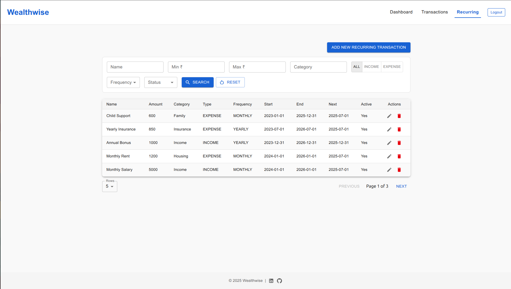

# Wealthwise

Wealthwise is a modern personal finance manager built with **React**, **Spring Boot**, **PostgreSQL**, and **Keycloak**. It helps you track income, expenses, savings, receipts, and recurring transactions with a clean dashboard and charts.

👉 **[Live Demo](https://wealthwise.ajadhav.com/)**

---

## ✨ Features

### Authentication & Security
- User registration, login, and logout
- OAuth 2.0 support (Google login)
- Keycloak-based authentication and authorization

### Transactions
- Create, Read, Update, Delete (CRUD)
- Pagination & search support

### Receipts
- Upload and store receipts in PDF, JPG, PNG formats
- View and download receipts anytime

### Recurring Transactions
- CRUD support for recurring payments (e.g., rent, subscriptions)
- Pagination & search functionality

### Dashboard
- Monthly transaction summary (income, expenses, savings)
- Visual charts (pie charts for spending categories)

### Progressive Web App (PWA)
- Installable on desktop and mobile

## 📸 Screenshots
- Login Page
  
- Dashboard
  
- Transactions Page
  
Recurring Transactions Page
  
---

## 🛠️ Tech Stack

- **Frontend:** React, Axios
- **Auth:** Keycloak, OAuth 2.0
- **Backend:** Java, Spring Boot, Spring Data JPA, Hibernate
- **Database:** PostgreSQL
- **Logging & Observability:** Log4j2, Promtail, Loki, Prometheus, Grafana
- **Containerization:** Docker, Docker Compose
- **Web Server:** Nginx, Certbot (Let's Encrypt)

---

## 🚀 Deployment

- Application runs on a VPS with Docker Compose.
- Nginx serves as reverse proxy with HTTPS enabled.
- Observability stack (Prometheus, Loki, Grafana) provides monitoring and centralized logging.

---

## 🎯 Motivation

I wanted a simple and privacy-focused tool to track my personal expenses. Instead of relying on third-party apps, I built Wealthwise and hosted it on the internet so that others can use it as well.
